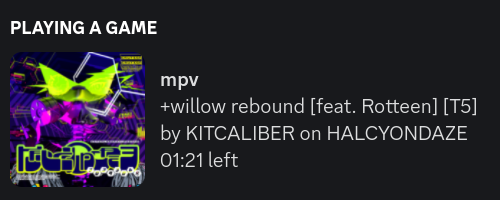

# `MPV Discord Rich Presence`

**Discord Rich Presence integration for MPV player written in Rust** 

# Features
- Simple installation configuration using JSON
- Ability to toggle activity using keybinding (default - D)
- Displays current file name and timestamps
- Displays track metadata (artist, title, album)
- Displays cover art from MusicBrainz archive
- Rusty! 🦀 

# Installation 
1. Download latest release and unzip it
2. Run the installer script
3. Keybindings can be changed in input.conf
4. Done!

# Why?
- Alternative solutions either require third-party dependencies or were unreliable in my experience
- Furthermore, none of them allow automatic pulling of cover art!
- Learning and gaining experience in Rust!

# Contributing
All issues and pull requests are welcome! Feel free to open an issue if you've got an idea or a problem. You can open a pull request if you are able to implement it yourself.

---

<strong>Made with ponies and love!</strong>

<strong>GNU GPL © Ryze 2023</strong>
